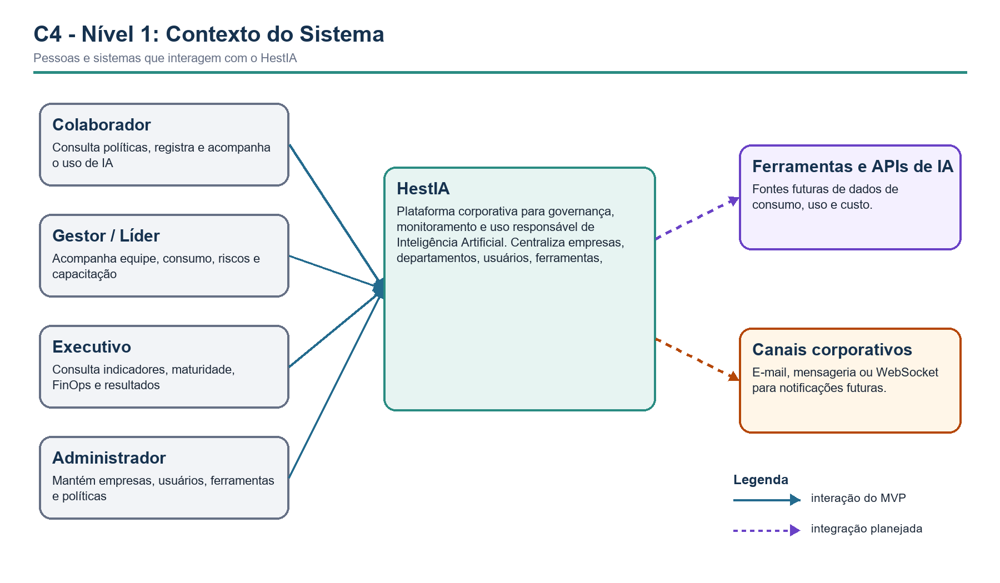
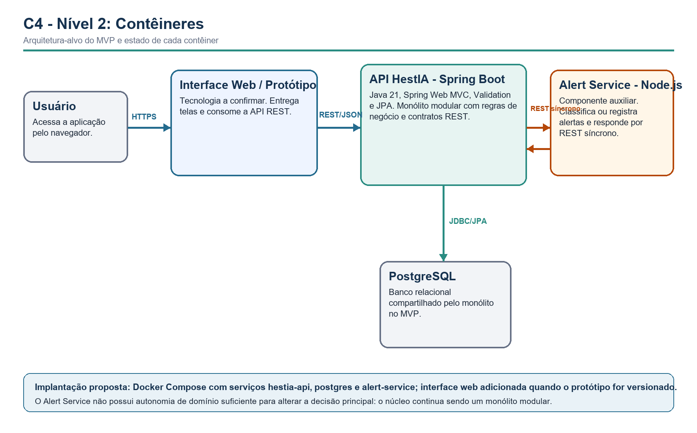
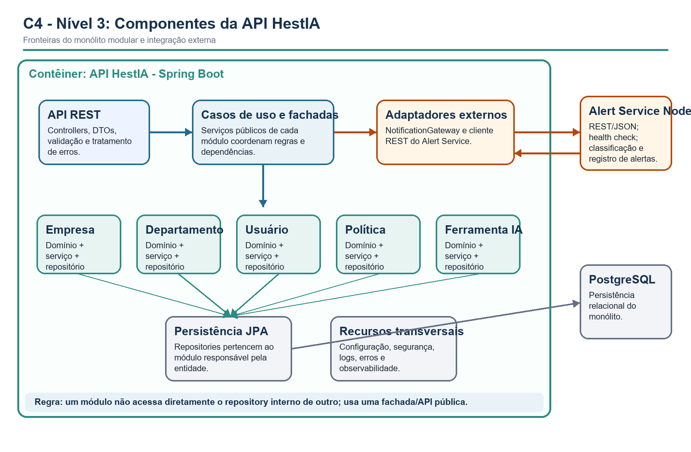

# SCRUM-105 — Documentação C4 do HestIA

## 1. Objetivo e convenções

Esta documentação representa a arquitetura-alvo do MVP definida na SCRUM-106
em níveis progressivos de zoom: **Contexto**, **Contêineres**, **Componentes** e
uma visão de **Código**. Elementos ainda não implementados são identificados
explicitamente para que o diagrama não seja confundido com o estado atual do
repositório.

| Notação | Significado |
|---|---|
| Azul ou verde | Elemento interno do HestIA ou do MVP. |
| Cinza | Pessoa, banco ou infraestrutura. |
| Amarelo ou roxo | Integração auxiliar ou futura. |
| Seta contínua | Relação necessária no MVP. |
| Seta tracejada | Relação planejada, ainda não implementada. |

## 2. Nível 1 — Contexto do sistema



[Fonte Mermaid do diagrama de contexto](diagrams/c4-contexto.mmd)

| Elemento | Tipo | Responsabilidade ou relação |
|---|---|---|
| HestIA | Sistema | Centraliza governança, uso, risco, políticas, ferramentas e indicadores de IA. |
| Colaborador | Pessoa | Consulta políticas e registra ou acompanha o uso de IA. |
| Gestor/Líder | Pessoa | Acompanha equipe, alertas, consumo e evolução. |
| Executivo | Pessoa | Consulta maturidade, produtividade, risco e FinOps. |
| Administrador | Pessoa | Mantém empresas, usuários, permissões, ferramentas e políticas. |
| Ferramentas/APIs de IA | Sistema externo futuro | Poderá fornecer telemetria e consumo. |
| Canais corporativos | Sistema externo futuro | Poderá receber notificações por e-mail, mensageria ou tempo real. |

## 3. Nível 2 — Contêineres



[Fonte Mermaid do diagrama de contêineres](diagrams/c4-conteineres.mmd)

| Contêiner | Tecnologia | Responsabilidade | Estado |
|---|---|---|---|
| Interface Web / Protótipo | A confirmar | Interface para os fluxos demonstráveis. | Planejado; não encontrado no repositório. |
| API HestIA | Java 21 e Spring Boot | Casos de uso, regras, APIs e persistência do núcleo. | Parcialmente implementado. |
| PostgreSQL | PostgreSQL | Dados corporativos do monólito modular. | Dependência definida; configuração a consolidar. |
| Alert Service | Node.js e Express | Avalia ou registra alertas e devolve nível e mensagem. | Planejado nas SCRUM-109 e SCRUM-159. |

O Alert Service é um componente auxiliar integrado por REST síncrono. Ele não
altera, por si só, o estilo do núcleo para microsserviços.

## 4. Nível 3 — Componentes da API HestIA



[Fonte Mermaid do diagrama de componentes](diagrams/c4-componentes.mmd)

| Componente | Responsabilidade | Dependências permitidas |
|---|---|---|
| API REST | Receber HTTP, validar DTOs e traduzir respostas e erros. | Casos de uso e fachadas públicas. |
| Empresa | Empresa, orçamento e configuração corporativa. | Persistência própria. |
| Departamento | Estrutura organizacional. | `EmpresaFacade`, nunca `EmpresaRepository`. |
| Usuário | Identidade, perfis e vínculo organizacional. | `EmpresaFacade` e `DepartamentoFacade`. |
| Política | Políticas, versões e ativação. | `EmpresaFacade`. |
| Ferramenta IA | Catálogo, aprovação, risco e custo. | `EmpresaFacade`. |
| Consumo/Indicadores | Registros de uso e agregações iniciais. | Ferramenta, empresa e `NotificationGateway`. |
| NotificationGateway | Porta de integração com o Alert Service. | Cliente REST externo; sem regra de domínio Node. |
| Persistência JPA | Adapters de banco pertencentes a cada módulo. | PostgreSQL. |

Regra central: um módulo não acessa diretamente o repository interno de outro;
ele usa uma fachada ou API pública.

## 5. Nível 4 — Visão de código

O nível de código é uma estrutura recomendada de pacotes. Classes concretas
devem acompanhar a evolução do repositório; este documento não substitui
diagramas detalhados de classe quando eles forem necessários.

```text
br.com.hestia
├── HestiaApplication
├── empresa
│   ├── api
│   │   ├── EmpresaController
│   │   ├── EmpresaRequest
│   │   └── EmpresaResponse
│   ├── application
│   │   ├── EmpresaFacade
│   │   └── EmpresaService
│   ├── domain
│   │   └── Empresa
│   └── infrastructure
│       └── EmpresaRepository
├── departamento
├── usuario
├── politica
├── ferramenta
├── consumo
├── notificacao
│   ├── application
│   │   └── NotificationGateway
│   └── infrastructure
│       └── NodeAlertClient
└── shared
    ├── config
    ├── error
    ├── security
    └── observability
```

## 6. Cenário dinâmico — registro de consumo e alerta

1. O usuário registra um uso ou consumo na Interface Web.
2. A interface envia `POST /api/v1/consumos` para a API HestIA.
3. A API valida usuário, empresa, ferramenta e política aplicável.
4. O módulo Consumo persiste o registro no PostgreSQL.
5. `NotificationGateway` envia ao Alert Service os dados necessários.
6. O serviço responde com nível `INFO`, `WARNING` ou `CRITICAL` e mensagem.
7. A API devolve a resposta consolidada à interface.
8. Em timeout, o consumo permanece válido; o alerta fica pendente ou é
   reportado como não avaliado.

| Chamada | Origem → destino | Contrato resumido |
|---|---|---|
| `POST /api/v1/consumos` | Interface → API HestIA | `empresaId`, `usuarioId`, `ferramentaId`, quantidade, unidade e contexto. |
| `POST /alerts/evaluate` | API HestIA → Alert Service | empresa, origem, métrica, valor, limites e `correlationId`. |
| `200 AlertResponse` | Alert Service → API HestIA | `level`, `message`, `evaluatedAt` e `correlationId`. |

## 7. Implantação

```text
docker-compose
├── postgres:5432       health: pg_isready
├── hestia-api:8080     depende do PostgreSQL saudável
├── alert-service:3001  health: /health
└── web-ui:3000         planejado; depende da API
```

- URLs, portas e credenciais são fornecidas por variáveis de ambiente.
- O banco não publica credenciais no repositório.
- Health checks determinam a ordem de inicialização.
- API e Node compartilham `correlationId` para rastrear o fluxo.

## 8. Coerência com o código e lacunas

| Evidência do repositório | Representação C4 | Lacuna |
|---|---|---|
| Pacotes `empresa`, `departamento`, `usuario` e `politica` | Módulos dentro da API HestIA. | Criar contratos públicos e fachadas. |
| `TipoFerramentaIA` | Módulo Ferramenta IA. | Entidade e camadas restantes pendentes. |
| Duas entidades `PoliticaUso` | Um único componente Política. | Remover a duplicidade antes do build final. |
| Services acessando repository de outro módulo | Setas passam por fachadas. | Refatorar dependências diretas. |
| Ausência de Node.js | Alert Service marcado como planejado. | Implementar nas Scrums seguintes. |
| Ausência de frontend versionado | Interface marcada como planejada. | Versionar protótipo ou documentar ferramenta externa. |

## 9. Critérios de aceite

- os níveis Contexto, Contêineres, Componentes e Código estão documentados;
- elementos possuem nome, tipo, responsabilidade, tecnologia e relações;
- os diagramas distinguem estado implementado, planejado e futuro;
- as relações respeitam a ADR-001 e a SCRUM-106;
- o cenário Spring Boot → Node.js → resposta está documentado;
- diferenças entre diagrama e código possuem ações de correção.

## Referências

- Canvas ESPM — Entregáveis 1, atividade 293213.
- LELES, Andréia Damasio. *Introdução à Arquitetura de Software — C4_v1*.
- LELES, Andréia Damasio. *Monólitos em Camadas x Monólito Modular x Microsserviços*.
- LELES, Andréia Damasio. *Integração do monólito com Node.js via REST*.
- HestIA — ADR-001: monólito modular com camadas internas.
- BROWN, Simon. *The C4 Model for Visualising Software Architecture*.
- Jira — SCRUM-105, consultada em 2 de setembro de 2026.
